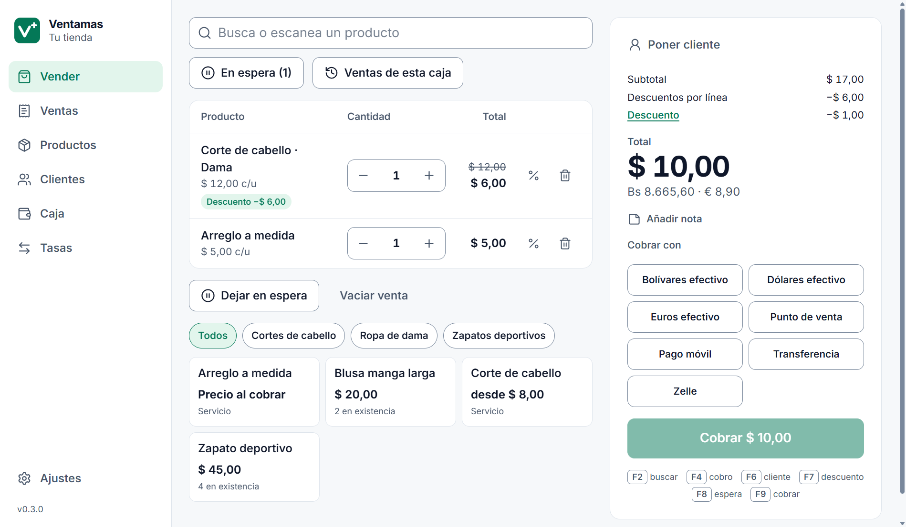
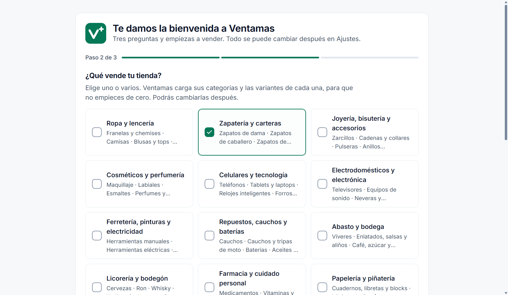
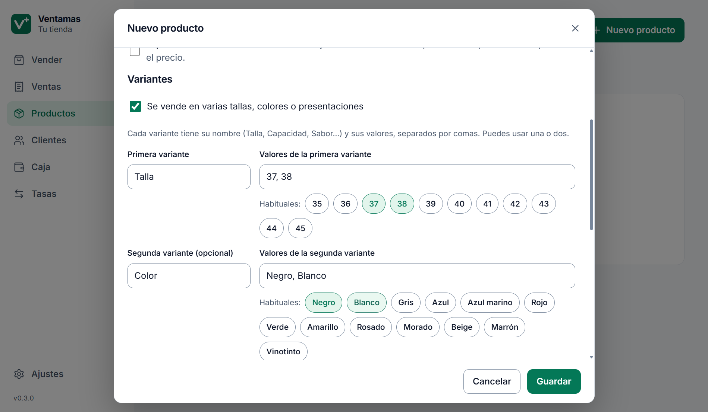
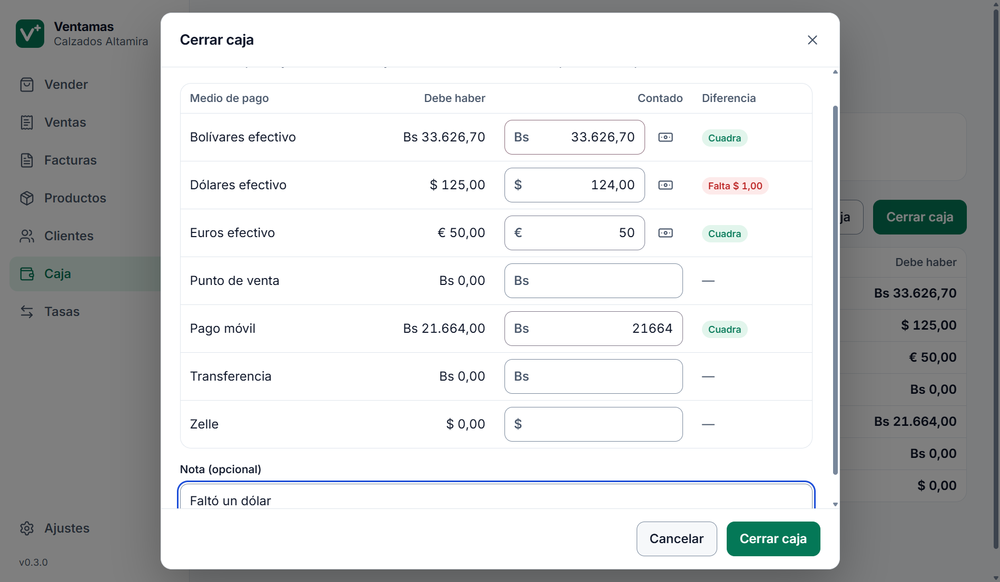

# Ventamas

Punto de venta, inventario y clientes para comercios pequeños. Se instala en la computadora del mostrador,
funciona sin internet y cobra en bolívares, dólares y euros con la tasa del día. Es software libre.



> **Estado: versión 0.3, de prueba.** Ya se puede vender productos y servicios, llevar clientes, cerrar la caja y,
> en algunos casos, facturar. Todavía faltan el fiado, las devoluciones, anular una venta y los usuarios con
> permisos: no la uses aún como único registro de tu tienda. El plan completo está en el
> [documento de requisitos](docs/PRD.md).

## Qué hace hoy

- **Empezar con el catálogo hecho.** Al abrirlo por primera vez eliges qué vende tu tienda entre 25 tipos de
  comercio (ropa, zapatería, celulares, ferretería, repuestos, abasto, peluquería, reparaciones…) y Ventamas carga
  sus categorías, cada una con las variantes que suelen tener sus productos.
- **Vender en una sola pantalla.** Busca por nombre, escanea el código de barras o toca el producto. Descuentos por
  línea y a toda la venta, cliente, nota y venta en espera. Se puede hacer todo solo con el teclado.
- **Cobrar en varias monedas.** Varios pagos en una misma venta, en bolívares, dólares o euros. Tras cada pago
  dice cuánto falta en cada moneda. Propone el vuelto en billetes enteros de la divisa y el resto en bolívares.
- **Tasa del día.** Se confirma una vez al día, a mano o trayendo la oficial del BCV para revisarla. Cada venta
  guarda la tasa con la que se cobró.
- **Productos con variantes**: tallas y colores, capacidades, presentaciones, sabores. Cada combinación con sus
  existencias, su código y, si hace falta, su precio.
- **Servicios**: sin existencias, con modalidades (corte de dama o de caballero) y precio abierto si se decide al
  cobrar.
- **Inventario que avisa.** Llegadas de mercancía, conteos, daños y pérdidas con su motivo; historial por
  producto; existencia mínima; costo promedio; margen; y lo que se vendió sin tener, marcado para revisar.
- **Clientes** con cédula o RIF, teléfono y sus compras.
- **Caja.** Apertura con fondo, entradas y salidas con motivo, corte parcial y cierre con conteo por medio de pago
  (billete por billete si quieres, y a ciegas si lo prefieres).
- **Impuestos, si los usas.** Vienen apagados. Con ellos, cada producto lleva su tasa y la venta desglosa base e
  impuesto sin que el total cambie un céntimo.
- **Recibo no fiscal**, para impresora térmica de 58 u 80 mm o como PDF.
- **Sin internet.** Los datos viven en el equipo de la tienda. Nada sale de él.
- **Ocho temas de color** y los datos de tu tienda.

| Elegir qué vende la tienda | Crear un producto desde su categoría | Cerrar la caja |
|---|---|---|
|  |  |  |

## Facturar: lee esto antes

En Venezuela **un programa no convierte un documento en factura**. Una factura vale si sale de una máquina fiscal,
de un talonario o forma libre de una imprenta autorizada por el SENIAT, o de una imprenta digital autorizada. Y
la ley obliga a usar **solo máquina fiscal** a casi todas las tiendas de ropa, calzado, comida y belleza que venden
al público.

Por eso la facturación viene apagada y ofrece dos caminos:

| Si tu tienda… | Ventamas… |
|---|---|
| factura con máquina fiscal, talonario o imprenta digital | anota en cada venta el número de esa factura, para tenerlo todo junto |
| puede facturar en formas libres | numera la factura y la imprime sobre tus hojas con número de control, la anula si hace falta y arma un auxiliar del libro de ventas |

Ventamas **no** se conecta con máquinas fiscales ni con imprentas digitales, no genera números de control y no
emite notas de crédito. El detalle y las normas consultadas están en la
[decisión 0008](docs/decisiones/0008-facturacion.md). No es asesoría legal: confirma tu caso con un contador.

## Importante

- **El recibo no es una factura.** Si tu comercio está obligado a facturar, debe seguir haciéndolo.
- **No se ha probado con equipos reales**: ni la impresora térmica, ni una forma libre de verdad, ni un lector de
  códigos. Los documentos se generaron y revisaron como PDF con el tamaño del papel.
- **El catálogo de categorías es un punto de partida.** Se escribió a partir de menús de tiendas venezolanas y no
  se ha validado con comerciantes: corrige lo que no encaje en Ajustes.
- **Todavía no vende por peso ni por metro.** Queso por kilo o cable por metro se cargan, por ahora, como
  presentaciones (250 g, 1 kg).
- **Windows mostrará un aviso de "editor desconocido"** al instalar, porque el instalador no tiene firma digital.

## Qué viene

Apartados y fiado, cambios y devoluciones, anular ventas, reportes, usuarios con permisos, respaldo, y la ayuda
dentro del producto. Después, venta por peso, finanzas básicas y la conexión con máquinas fiscales. El orden está
en el [plan de crecimiento](docs/PRD.md#11-plan-de-crecimiento).

## Documentación

| Documento | Contenido |
|---|---|
| [docs/PRD.md](docs/PRD.md) | Qué se va a construir, para quién y en qué orden |
| [docs/investigacion.md](docs/investigacion.md) | Qué existe ya, cómo cobra hoy un comercio pequeño y qué exige facturar |
| [docs/modelo-de-datos.md](docs/modelo-de-datos.md) | Principios del modelo de datos y tablas |
| [docs/sistema-de-diseno.md](docs/sistema-de-diseno.md) | Tipografía, espaciado, componentes y los ocho temas |
| [docs/decisiones/](docs/decisiones/) | Decisiones técnicas y sus razones |

## Desarrollo

Requisitos: Windows 10 u 11 y [Node.js](https://nodejs.org) 24 o superior.

```bash
npm install
```

```bash
npm run dev
```

| Comando | Qué hace |
|---|---|
| `npm run dev` | Abre la aplicación con recarga en caliente |
| `npm test` | Pruebas unitarias: dinero, cobro, descuentos e impuestos, productos, catálogo, caja, ventas, facturas, migraciones |
| `npm run typecheck` | Revisión de tipos |
| `npm run build` | Compila la aplicación en `out/` |
| `npm run e2e` | Abre la aplicación compilada y recorre un día completo de una tienda |
| `npm run dist` | Genera el instalador de Windows en `dist/` |
| `npm run lock-migrations` | Registra las migraciones nuevas (ver [decisión 0002](docs/decisiones/0002-sqlite-integrado-y-migraciones.md)) |
| `npm run icon` | Regenera los iconos desde `build/icon.svg` |

En desarrollo los datos se guardan en `%APPDATA%\Ventamas-desarrollo`, aparte de los de la aplicación instalada
(`%APPDATA%\Ventamas`).

### Estructura

```
src/
├─ main/        proceso principal: ventana, base de datos, migraciones e impresión
├─ preload/     puente entre la interfaz y el proceso principal
├─ renderer/    interfaz (React): armazón, componentes y estilos compartidos
├─ shared/      lógica común: dinero, repartos, documentos de identidad, temas, ajustes y validación
└─ modules/     un módulo por carpeta: nucleo, monedas, impuestos, inventario, caja, clientes, ventas, facturacion
```

Cada módulo tiene su contrato (`api.ts`), sus datos y operaciones (`main/`) y sus pantallas (`renderer/`). Cómo
añadir uno está en la [decisión 0004](docs/decisiones/0004-modulos-compilados.md). El catálogo de tipos de comercio
vive en un solo archivo, fácil de corregir o ampliar:
[`src/modules/inventario/main/catalog.ts`](src/modules/inventario/main/catalog.ts).

## Licencia

[AGPL-3.0](LICENSE). Puedes usar, modificar e instalar Ventamas libremente. Si distribuyes una versión modificada
o la ofreces como servicio, debes publicar tus cambios bajo la misma licencia.

El nombre «Ventamas» y su logo identifican a este proyecto: una versión modificada debe distribuirse con otro
nombre.

La tipografía Inter se incluye bajo la [SIL Open Font License](src/renderer/src/assets/fonts/OFL-Inter.txt).
